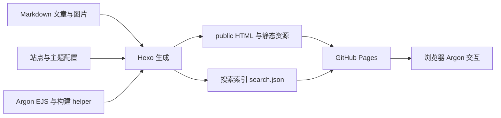

# 项目架构

最后核对：2026-10-08（Asia/Shanghai）。本文描述当前实际实现；改进建议和动态状态见 [PROGRESS.md](PROGRESS.md)，目标及验收见 [REQUIREMENT.md](REQUIREMENT.md)。

## 1. 总体结构

本项目是 Hexo 静态博客。Node.js 在构建期运行 Hexo，将 Markdown、配置、EJS 模板和静态资源转换为 `public/`。浏览器加载静态页面及 Argon 的 JavaScript 完成交互；GitHub Pages 承载生成文件。项目没有自建后端、业务 API 或持久化数据库。



## 2. 技术栈与目录

| 层次 | 当前实现 |
| --- | --- |
| 构建运行时 | Node.js；现有 CI 使用 20，本地核验为 22.18.0；Hexo 8.1.2 要求 Node `>=20.19.0` |
| 静态站点引擎 | `package.json` 声明 Hexo `^8.0.0`，当前锁定/安装版本为 8.1.2 |
| 内容渲染 | `hexo-renderer-marked` 渲染 Markdown，`hexo-renderer-ejs` 渲染模板，另声明 Stylus renderer |
| 路由生成 | index、archive、category、tag 生成器；`hexo-generator-search` 生成搜索索引 |
| 活跃主题 | 仓库内 `themes/argon/`，主题版本 helper 返回 1.0.2；样式以 CSS 为主 |
| 浏览器能力 | jQuery、Pjax、Highlight.js、KaTeX、懒加载、图片放大等主题资源 |
| 托管 | `.github/workflows/pages.yml` 构建并部署 GitHub Pages |

依赖中也声明 Landscape 和 NexT，但 `_config.yml` 的 `theme: argon` 决定当前使用 Argon；它们不构成活跃的第二套页面渲染系统。具体版本以 `package-lock.json` 为准，升级时重新核对环境要求。

```text
AlgoStruggler.github.io/
├── AGENTS.md / AGENT.md      # agent 入口和开发约定
├── REQUIREMENT.md           # 目标及验收
├── ARCHITECTURE.md           # 实现和技术决策
├── PROGRESS.md               # 进度、缺陷和接手信息
├── _config.yml              # 全站配置与生成器设置
├── package.json / package-lock.json
├── .github/
│   ├── workflows/pages.yml  # main push → build → Pages
│   └── dependabot.yml       # npm 依赖每日检查配置
├── scaffolds/               # post/page/draft 的新建模板
├── source/
│   ├── _data/argon.yml      # 实际生效的主题配置
│   ├── _posts/              # Markdown 与同名文章资源目录
│   └── assets/img/          # author.png、violet.jpg 等站点资源
├── themes/argon/
│   ├── _config.yml          # 主题自带默认配置
│   ├── scripts/             # 配置加载及 Hexo helper
│   ├── layout/              # EJS 页面和局部模板
│   └── source/              # JS、CSS、主题图片及 vendor 文件
├── public/                  # 构建输出，Git 忽略
├── db.json                  # Hexo 本地缓存，Git 忽略
└── node_modules/            # 安装依赖，Git 忽略
```

`themes/argon/` 的文件已直接被本仓库 Git 跟踪，并非当前依赖运行时下载的主题目录。主题附带 `LICENSE`；自定义改动保留原有许可文件与署名。仓库父目录中的 `plaintext-code-block.png` 不属于网站源码。

## 3. 配置加载与渲染链路

1. Hexo 读取根 `_config.yml`：站点地址 `https://AlgoStruggler.github.io`、中文、`Asia/Shanghai`、路由、分页、主题及搜索配置。
2. 加载 `themes/argon/` 的布局与脚本。`scripts/functions.js` 在 `generateBefore` 中读取 `hexo.locals.get('data').argon`，存在时将其赋给 `hexo.theme.config`，随后挂入 `rootConfig`。
3. 因此 `source/_data/argon.yml` 是实际主题配置来源；它替换主题配置对象，不能理解为仅覆盖同名键。需要保留菜单、评论开关等模板所依赖的配置结构。
4. 渲染文章，执行主题 helper，例如摘要、字数、阅读时间、头图和图片懒加载预处理，再生成页面。
5. `layout/layout.ejs` 包含 header、sidebar、footer，并按首页、文章、独立页、归档、标签或分类选择内容模板。
6. `layout/post.ejs` 对文章使用 `_partial/content-article.ejs` 和 `article-bottom.ejs`；独立页面使用 `_partial/content-page.ejs`。单纯创建通用 page 不会自动获得分类/标签总览能力。
7. `source/` 与主题 `source/` 的静态资源进入输出。头像及全屏插画背景分别来自站点 `author.png`、`violet.jpg`。`transparent_banner: true` 让插画延续到横幅；主题 `banner.jpg` 保留原配置。
8. 用户要求回滚到优化前版本，网站配置与主题源码已恢复为 `6b6e152` 的内容；删除优化期间新增的 `blog.css`、集合模板和三个独立页面。当前继续使用原 `style.css`，恢复原圆角、居中标题、公告、打字效果、元信息和移动设置。开发文档及 JavaScript 文章更新仍保留。

## 4. 内容、路由与资源

文章存放于 `source/_posts/`。默认路径由 `:year/:month/:day/:title/` 决定，显式 front matter `permalink` 可覆盖。当前 HTML + CSS 文章的地址为 `/2026/09/27/lesson-04-html-css/`；该约定来自已有源码，不应在标题修改时意外丢失。

`post_asset_folder: true` 允许同名文章资源目录，例如第零篇的比赛照片。新图片沿用文章内 `asset_img` 用法或经过验证的本地资源引用；Linux 部署区分文件名大小写。

首页和文章列表分页为每页 10 篇，首页按 `-date` 排序。archive/category/tag 插件生成归档和各分类、标签详情页。回滚恢复优化前页面结构，当前没有 `/categories/index.html`、`/tags/index.html` 和 `/about/index.html`；菜单有链接不会自动生成对应页面。回滚不修改已有文章标题、日期或 permalink。

## 5. 浏览器交互与已知不一致

### 代码高亮

根配置为 `syntax_highlighter: ''`，Hexo Highlight 关闭；虽然保留 `prismjs.enable: true`，当前高亮提供者选择为空。主题配置开启 `enable_code_highlight`，选择 `monokai`，由浏览器 `argontheme.js` 的 `highlightJsRender()` 处理 `article pre > code`，加入行号、复制及折行控件。

初始化和 `pjax:complete` 均调用高亮。改变代码渲染结构时同时检查转义、语言 class、纯文本块、复制内容及重复初始化。最新已有提交 `a0d9177` 使用 `plaintext` 围栏修复纯文本显示；本次静态核验确认 HTML + CSS 输出包含 3 个 `language-plaintext` 代码块，尚未进行浏览器交互验收。

### 搜索

`hexo-generator-search` 按回滚后的原配置生成 `public/search.json`，索引包含 12 篇文章。主题 `searchFunc()` 使用 `dataType: "xml"` 并遍历 `entry` 元素，恢复了优化前的数据格式不一致状态。此前 XML 搜索修复与界面优化一起撤销；如果用户另行要求修复搜索，再按 FR-04 实施。

### Pjax、媒体与外部服务

Pjax 对站内导航局部更新 `#primary`、侧栏等容器；新交互必须适配首次加载和跳转后的生命周期。图片经主题处理实现懒加载和放大，公式按配置从 CDN 加载 KaTeX；字体和部分外部资源也有网络依赖，构建时不会证明这些请求成功。

Gitalk、giscus、Waline、Twikoo、百度统计及 gtag 的配置开关均关闭。不过 `header.ejs` 仍直接加载不蒜子脚本用于访问统计，不能将“分析配置关闭”等同于“无第三方网络请求”。新增或调整外部服务时检查模板实际加载逻辑。

## 6. 构建与发布

本地 `npm run build` 调用 `hexo generate`；干净构建先运行 `npm run clean`。`public/` 及 `db.json` 不跟踪，源文件是修复和回退的依据。受限环境中若文件监听报 EPERM，可通过 `npm run server -- --static --ip 127.0.0.1 --port 4408` 预览构建产物；此模式不自动重新生成文件，修改后先执行 build。4408 为本轮使用的空闲端口，不是部署配置。

现有 Pages 工作流仅监听 `main` 的 push，未配置 PR 检查或手动 dispatch：

1. Ubuntu runner checkout，配置递归 submodules（当前主题为普通被跟踪目录）。
2. setup-node 使用 Node.js 20。
3. 按 OS 键缓存 `node_modules/`，随后执行 `npm install`。
4. 执行 `npm run build`，上传 `public/` 为 Pages artifact。
5. deploy job 使用 `pages: write` 和 `id-token: write` 权限，部署到 `github-pages` 环境。

本地建议使用 `npm ci` 保持锁文件安装；CI 当前实际使用 `npm install`，并未完成这项改造。基于锁文件的缓存及 PR 构建检查也属于待办。`deploy.type` 为空，因此不依赖 `hexo deploy` 发布。

## 7. 维护决策与扩展位置

| 决策 | 原因与维护影响 |
| --- | --- |
| 保持 Hexo + Argon | 适配已有 Markdown 博客与静态托管；新增需求优先使用现有扩展点 |
| 内容、全站配置和主题实现分离 | 普通发文无需修改模板；可通过受影响路径缩小回归范围 |
| 输出目录可再生成 | 通过源码变更修复和回退，避免本地与线上行为分叉 |
| 先验证契约再声明完成 | 搜索格式、菜单目标和浏览器生命周期均需要跨文件核对 |

新增简单页面从 `source/<页面>/index.md` 和 page 模板入手；分类/标签总览需要重新评估主题能力。新增构建 helper 放在主题 `scripts/`，交互从 `argontheme.js` 生命周期入手，外观先尝试 `argon.yml` 配置，再编辑现有 `style.css`。当前用户已撤销本轮界面优化，不在后续任务中自动恢复已删除的定制。结构性调整时同步本文件并记录理由、验证和兼容影响。
